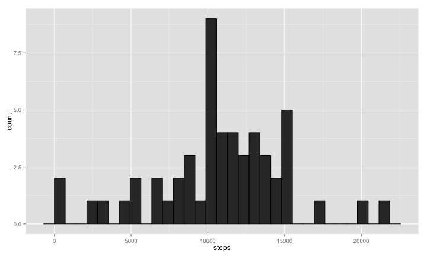
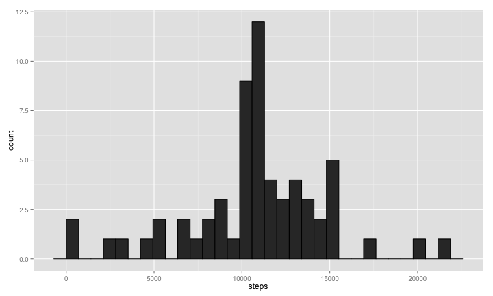

# Reproducible Research: Peer Assessment 1

Project 1 
========================================================

## Loading and preprocessing the data


```r
##Loading and preprocessing the data
## Reading the data file from the link as a zip file
temp <- tempfile()
download.file("http://d396qusza40orc.cloudfront.net/repdata%2Fdata%2Factivity.zip",temp)
data <- read.csv(unz(temp, "activity.csv"))
## remove NA's values
cleanData<-na.omit(data)
## Calculate the total number of steps for each day
sumData<-aggregate(steps ~ date, cleanData, sum)
```

## What is mean total number of steps taken per day?

Here is a histogram of the total number of steps taken each day:


```r
## Plot of a histogram of the total number of steps taken each day
library("ggplot2")
ggplot(sumData, aes(steps)) +geom_histogram(stat="bin", colour="black")
```

```
## stat_bin: binwidth defaulted to range/30. Use 'binwidth = x' to adjust this.
```

 

Here is the mean of the total number of steps taken each day:

```r
##calculate and report the mean of the total number of steps taken per day
mean(sumData$steps)
```

```
## [1] 10766
```

Here is the median of the total number of steps taken each day:

```r
##calculate and report the median of total number of steps taken per day
median(sumData$steps)
```

```
## [1] 10765
```

## What is the average daily activity pattern?

Here is the time series plot for each 5-minute interval (x-axis) and the average number of steps taken across all days (y-axis):

```r
meanData<-aggregate(steps ~ interval, cleanData, mean)
plot(meanData$interval,meanData$steps,type="l",ylab="Average Steps Taken",xlab="Interval")
```

 


Here is the interval that has the maximum number of steps on average:

```r
subset(meanData$interval, meanData$steps == max(meanData$steps))
```

```
## [1] 835
```
## Imputing missing values

The total number of missing value we have is:

```r
##Counting the number of missing record of steps in the data frame
sum(is.na(data$steps))
```

```
## [1] 2304
```

We will replace each missing value with the mean for that 5-minute interval

```r
## take a copy of the original data for further changes
data2<-data
NAdata<-subset(data2,is.na(data2$steps)) ## subset data set with missing steps value
Compdata<-subset(data2,!is.na(data2$steps)) ## subset data set with complete steps value
## loop to assign the average steps per interval to the missing steps record
for(i in 1:sum(is.na(NAdata$steps))){
      NAdata[i,1]<-meanData[which(NAdata[i,3]==meanData[,1]),2]
}
## merge the to data sets together again in order to create a new dataset that is equal to the original dataset but with the missing data filled in
finalData<-rbind(NAdata,Compdata)
```

Total missing value after replacing

```r
sum(is.na(finalData$steps))
```

```
## [1] 0
```

Here is a histogram of the total number of steps taken each day after replacinf the NAs with the mean:


```r
## Calculate the total number of steps for each day
finalDataSum<-aggregate(steps ~ date, finalData, sum)
## Plot of a histogram of the total number of steps taken each day
library("ggplot2")
ggplot(finalDataSum, aes(steps)) +geom_histogram(stat="bin", colour="black")
```

```
## stat_bin: binwidth defaulted to range/30. Use 'binwidth = x' to adjust this.
```

 

Here is the mean of the total number of steps taken each day:

```r
##calculate and report the mean of the total number of steps taken per day
mean(finalDataSum$steps)
```

```
## [1] 10766
```

Here is the median of the total number of steps taken each day:

```r
##calculate and report the median of total number of steps taken per day
median(finalDataSum$steps)
```

```
## [1] 10766
```

#### Do these values differ from the estimates from the first part of the assignment? What is the impact of imputing missing data on the estimates of the total daily number of steps?
the valuse did not differ much from the pervouis plot becouse we replaces the missing values with the means. So statisticlly, the mean should remain the same. However, the medain might differ a little and this is exactly what happened


## Are there differences in activity patterns between weekdays and weekends?

Here we create a new factor variable in the dataset with two levels (weekday and weekend) :

```r
## add factor for weekends and weekdays on the finalData data set
finalData<-transform(finalData, dayofweek=as.POSIXlt(date, format='%Y/%m/%d')$wday %in% c(0, 6))
## set weekend as logical vector
weekend <- weekdays(as.Date(finalData$date)) %in% c("Saturday", "Sunday") ## set up logical/test vector
##
finalData$dayofweek[weekend == TRUE] <- "weekend"
finalData$dayofweek[weekend == FALSE] <- "weekday"
##
weekdaysdata<-subset(finalData,finalData$dayofweek=="weekday")
weekendsdata<-subset(finalData,finalData$dayofweek=="weekend")
weekdaysMeanData<-aggregate(steps ~ interval, weekdaysdata, mean)
weekendsMeanData<-aggregate(steps ~ interval, weekendsdata, mean)
##
```

Plotting weekdays

```r
plot(weekdaysMeanData$interval,weekdaysMeanData$steps,type="l",ylab="Average Steps Taken",xlab="Interval",main="Weekdays")
```

 

Plotting weekends

```r
plot(weekendsMeanData$interval,weekendsMeanData$steps,type="l",ylab="Average Steps Taken",xlab="Interval",main="Weekends")
```

 
